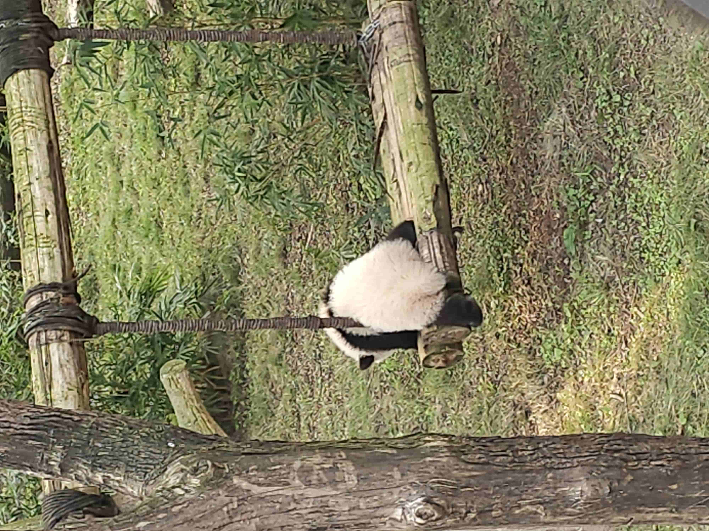

# 💫 About Me:
👋 Hi, I'm Kevin a software engineering student passionate about solving real-world problems.       I love brainstorming unique ideas and sharing them with my team to tackle challenges creatively.  I’m always open to collaborating on meaningful projects or contributing to open-source software. Let’s connect!
 Let’s connect!  Beyond coding, I have a keen interest in history, and gaming, which inspire my creative approach to solving complex challenges. I aim to create software that not only works but makes life better for users. I’m open to internships, collaborative projects, and opportunities to grow as a developer.

# 💻 Tech Stack:
          
# 📊 GitHub Stats:

<table>
  <tr>
    <td>
      
    </td>
    <td>
      
    </td>
    <td>
      
    </td>
  </tr>
</table>

## 🏆 GitHub Trophies

<!-- Proudly created with GPRM ( https://gprm.itsvg.in ) -->

<!-- code by tobiasmeyhoefer -->
<picture>
  <source media="(prefers-color-scheme: dark)" srcset="https://raw.githubusercontent.com/k3v123/k3v123/output/github-snake-dark.svg" />
  <source media="(prefers-color-scheme: light)" srcset="https://raw.githubusercontent.com/k3v123/k3v123/output/github-snake.svg" />
  
</picture>
